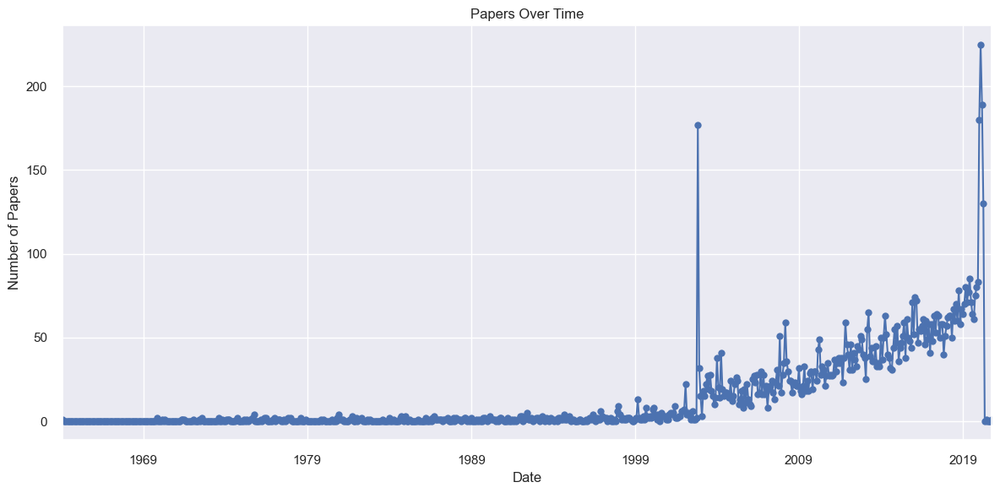
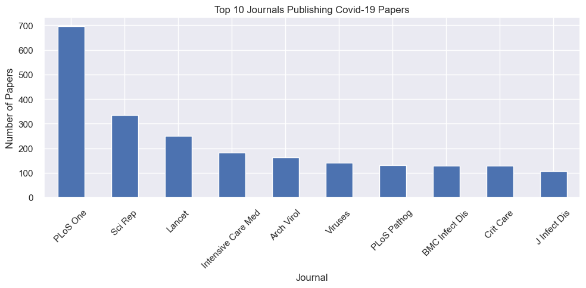
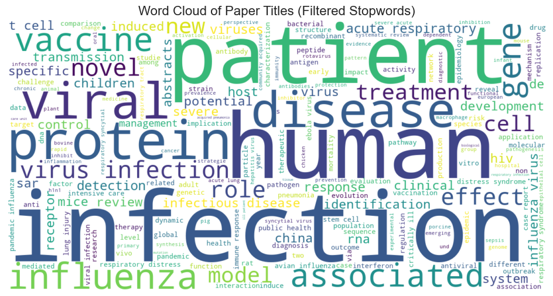
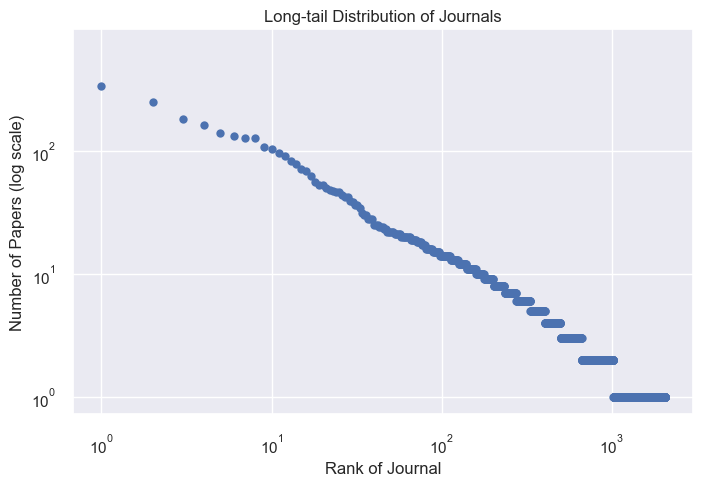

## Analysis of COVID-19 Research Publications Dataset

## 1. Introduction

This report analyzes a dataset of academic publications containing information such as titles, journals, and publication years. The goal is to identify trends in publication output, key journals, and thematic focus areas.

Live link: https://vinolago-python-assignments-app-bj3azb.streamlit.app/

## Specifically, we explore:

- Growth of publications over time

- Distribution of papers across journals

- Keyword patterns extracted from paper titles

- Long-tail distribution of journals

## 2. Methods

We used Python (Pandas, Matplotlib, WordCloud) for data cleaning and visualization. Additionally, an interactive Streamlit dashboard was developed to allow dynamic exploration of the dataset, including filters and sliders for customization.

## Key visualizations:

- Publication trend over time

- Top publishing journals

- Word cloud of paper titles (with stopwords removed)

- Long-tail journal distribution (log-log plot)

## 3. Findings

## a. Publication Trends

Observation: Publications steadily increased from early 2000s to 2020, with a peak around 2002 and 2020.

Insight: This indicates growing research interest in this domain.



## b. Top Journals

Observation: The top publishing journals are PLoS One, Sci Rep, and Lancet.

Insight: A small number of journals dominate the field, suggesting where impactful research is concentrated.



## c. Keyword Patterns (Word Cloud)

Observation: Frequent terms include Virus, Influenza, and Infection.

Insight: The field emphasizes infectious diseases affecting humans, particularly those related to respiratory illness.



## d. Long-tail Distribution of Journals

Observation: The distribution shows a long-tail pattern—most journals publish very few papers, while a handful contribute a large share.

Insight: This aligns with typical publication ecosystems where research output is concentrated in select journals.



## 4. Conclusion

The dataset reveals clear patterns:

- Steady growth in research output

- Concentration of publications in a few dominant journals

- Thematic emphasis on infectious diseases affecting humans (respiratory illness)

- Long-tail distribution consistent with research publishing trends

## Next steps:

Future analysis could include citation impact, collaboration networks, and topic clustering to provide deeper insights into the research landscape.

## Interactive Dashboard

To explore interactively, run the Streamlit app:

```bash
streamlit run app.py


```

readme
